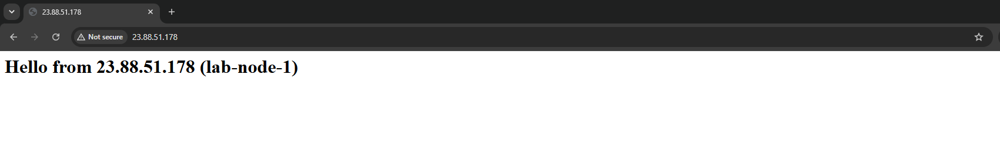
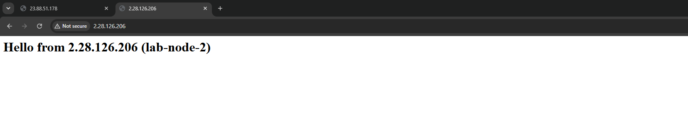
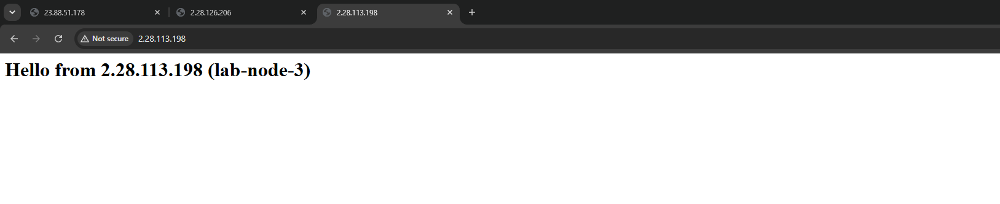
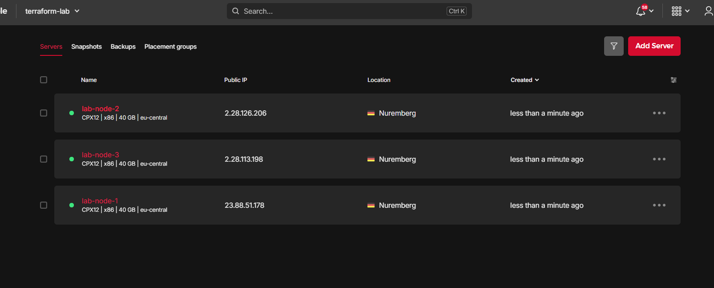
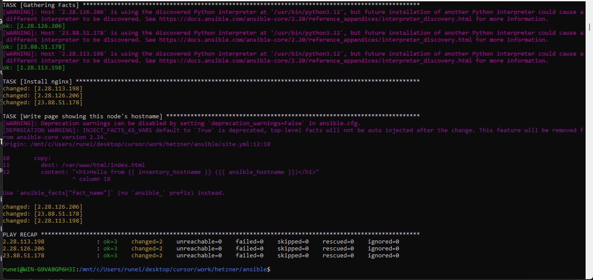

# Hetzner lab: Terraform + Ansible

Builds 3 Ubuntu servers on Hetzner Cloud with Terraform, configures them with Ansible, tears them down. Total cost per run: about 2 cents.

## The problem this solves

Terraform builds servers. Ansible configures them. But Ansible needs the server IPs, and the IPs change every rebuild.
Copying them by hand is error-prone. So Terraform writes Ansible's inventory file itself, using a template.
One `apply` gives you servers and a ready-to-use inventory.

## How it works

```
terraform apply
   |- creates SSH key + 3 servers (cpx12, Nuremberg)
   '- renders inventory.tmpl -> ansible/inventory.ini   (local_file)

ansible-playbook site.yml
   |- installs nginx on all 3
   '- writes a page showing each node's own hostname

terraform destroy
```

## Run it yourself

Needs a Hetzner Cloud API token (Read & Write) and an SSH key pair. Both are passed in as variables, nothing is read from the author's machine.

```
cd terraform
export TF_VAR_hcloud_token=...                          # never commit this
export TF_VAR_ssh_public_key="$(cat ~/.ssh/hetzner_lab.pub)"
terraform init
terraform apply

cd ../ansible
export ANSIBLE_CONFIG=$PWD/ansible.cfg
ansible-playbook site.yml

cd ../terraform
terraform destroy
```

## Proof it ran

| | |
|---|---|
|  |  |
|  |  |

Ansible run:



## Notes

- Terraform state and `inventory.ini` are gitignored: state can contain secrets, inventory is generated output.
- The Hetzner project is separate from any production servers. This token can't touch them.
- `host_key_checking = False` because fresh servers get new host keys every rebuild.
